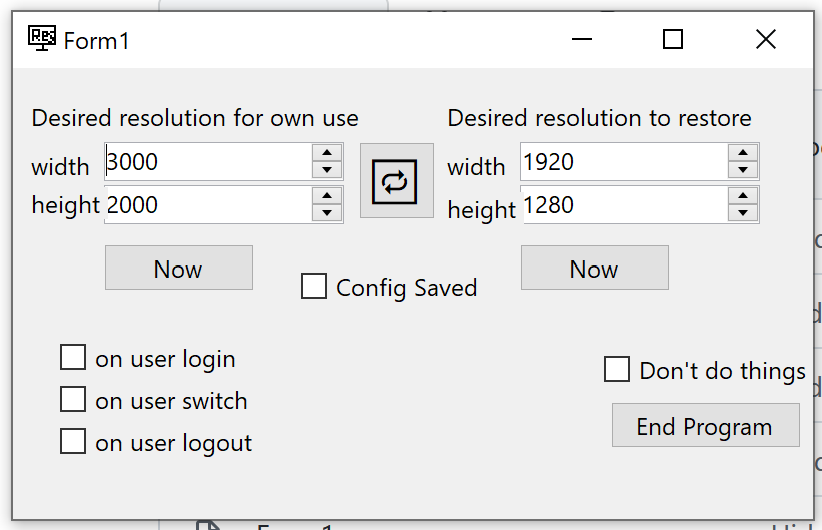

# Resolutioner
## a Windows program

screenshot is a bit outdated

**Resolutioner is a program for changing primary screen's
resolution on triggers.**

It could be written as a Windows Service to be above all users
and sessions but is not, and instead aims to work by autostarting.

### To do
 - [X] `CORE` actual resolution setting
 - [ ] `FEAT` handling errors of resolution changing instead of ignoring them
 - [X] `CORE` saving and loading config on start
   - does it really work? sometimes it worked sometimes not?
 - [X] `CORE` trigger: "Now" button
 - [ ] `CORE` trigger: user login
   - [ ] autostart
   - [ ] trigger: on start
 - [X] `CORE` trigger: user switch
   - [ ] separate lock/unlock desired/restored
   - [ ] maybe columns of all SessionSwitchReasons
 - [X] `CORE` trigger: user logout
 - [ ] `FEAT` trigger: distinction between logoff and shutdown
 - [ ] `FEAT` change scaling too, i think it's even in DEVMODE

### Usage

Click "swap" button to swap "for own use" and "to restore"
resolutions.

Click fetch buttons on the sides to fetch current screen
resolutions into the inputs. If the exact resolution was already
in the opposite inputs, resolution will not be inserted and
the "swap" button will be assigned focus.

"Config Saved" is checked when the config has not changed
since load or since last write. Checking the box triggers write
(save).

"Don't do things" will be stored in the config too and will
inhibit just the resolution changes.